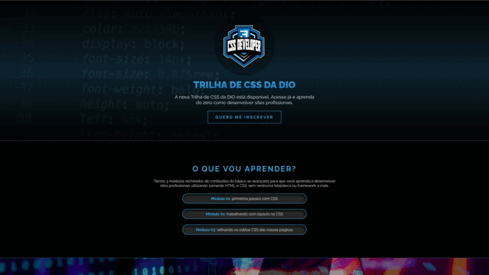
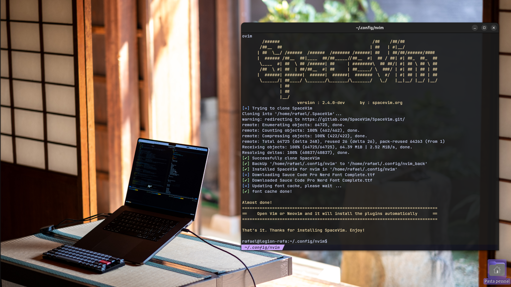

# Desafio: Trilha CSS da Dio Innovation One

## Descrição

Durante o curso foi apresentado todos os fundamentos do CSS, manipulação de imagem, texto, sombras e afins.

O objetivo deste desafio é colocar em uma página os conceitos apresentados, por isso, temos `background-fixed` para o efeito de movimento no meio da página. Alinhamento por ID, Classes, Atribuições e afins.

## Conteúdo

O projeto consiste em várias seções:

- **Header**: Apresenta o logotipo da Trilha de CSS da DIO, um título e uma breve descrição do curso, junto com um botão de inscrição.
- **O que vou aprender?**: Uma seção que lista os três módulos do curso.
- **Transforme o mundo**: Uma seção destacando a missão da plataforma.
- **Desafios profissionais**: Uma seção com um título, uma imagem e um parágrafo sobre a missão da DIO em preparar os alunos para as melhores oportunidades.
- **Footer**: Contém o logotipo da DIO e um link para o site da plataforma.

## Visualização

Para visualizar o projeto, basta clonar este repositório e abrir o arquivo `index.html` em seu navegador.

## Tecnologias Utilizadas

- HTML5
- CSS3

#### Informações sobre o autor:

- Projeto para o curso CSS de 46hrs que pertence ao caminho **FullStack Web Development**
- Produzido com editor de texto **NeoVIM** usando _SpaceVIM_ como gerenciador de plugins.
- Utilizado Sistema Operacional Gentoo Linux.

